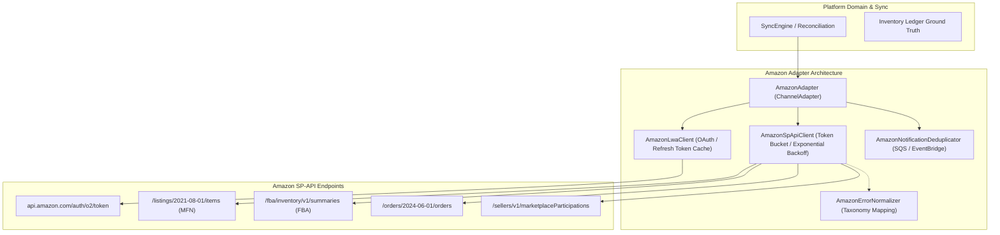

# Amazon Selling Partner API (SP-API) Adapter Architecture

**Status:** `VERIFIED`  
**Governing Documents:**
- `specifications/01_ENGINEERING_SPEC.md` (Sections 24, 25, 38, 39, 42, 43)
- `specifications/02_PRODUCT_DESIGN_SPEC.md` (Section 8 — Freshness & Trust Model)
- `specifications/06_SEQUENTIAL_PROMPTS_V3_SUPABASE.md` (Prompt 16)

---

## 1. Architectural Overview

The **Amazon Channel Adapter** integrates the platform with the Amazon Selling Partner API (SP-API). It establishes authenticated communication, token lifecycle management, rate limiting, error normalization, order ingestion, and inventory control conforming strictly to official Amazon SP-API guidelines and the platform's architectural constitution.

---

## 2. Supported API Versions & Deprecation Guard

Conforming to Prompt 16 ("For every SP-API model used, determine the currently supported API version from Amazon's official documentation at implementation time. Do not implement deprecated versions"):

| API Subsystem | Active Supported Version | Deprecated / Prohibited Versions | Role / Permission |
|---|---|---|---|
| **Orders API** | `2024-06-01` | `v0` (Deprecated) | `Direct-to-Consumer Shipping` |
| **Listings Items API** | `2021-08-01` | Legacy Feeds (flat file) | `Pricing / Inventory / Listings` |
| **FBA Inventory API** | `v1` | N/A | `Fulfillment by Amazon / Inventory` |
| **Feeds API** | `2021-06-30` | `2020-09-04` (Deprecated) | `Feeds` |
| **Notifications API** | `v1` | N/A | `Notifications` |
| **Sellers API** | `v1` | N/A | `Selling Partner Insights` |

Any request directed towards a deprecated version path triggers `assertNotDeprecatedSpApiVersion()`, immediately failing with a typed `ProviderValidationError` to protect data integrity and avoid unexpected silent provider rejections.

---

## 3. Section 39 Fulfillment Channel Isolation (MFN vs FBA)

Section 39 of `01_ENGINEERING_SPEC.md` requires strict separation between **Merchant Fulfillment Network (MFN)** and **Fulfillment by Amazon (FBA)**:

### 1. The Core Invariant
> **Direct merchant inventory pushes cannot mutate Amazon FBA quantities.**  
> FBA stock is physically stored and counted in Amazon Fulfillment Centers. Changes to FBA stock occur solely via Amazon Inbound Shipments and physical warehouse events.

### 2. Implementation Enforcements
- **MFN Read / Write:** Handled via Listings Items API (`PATCH /listings/2021-08-01/items/{sellerId}/{sku}`). Mutates `fulfillment_channel_code: "DEFAULT"`.
- **FBA Read:** Handled via FBA Inventory Summaries API (`GET /fba/inventory/v1/summaries`). Ingests `fulfillableQuantity`, `reservedQuantity`, `inboundWorkingQuantity`, etc.
- **FBA Write Guard:** Attempting an outbound inventory push with `fulfillmentChannel === "FBA"` is rejected with `ProviderValidationError` before any HTTP call can occur.

---

## 4. SP-API Operations Catalog

Every core operation documents required roles, scopes, regions, PII requirements, rate limits, and retry semantics (`SP_API_OPERATIONS_CATALOG`):

| Operation Key | SP-API Path | Scope | Regions | PII? | Rate (RPS / Burst) | Retry Semantics |
|---|---|---|---|:---:|---|---|
| `AUTHENTICATE` | `https://api.amazon.com/auth/o2/token` | `notifications` | ALL | No | 5 / 10 | Retry 500/503; do not retry 400/401 |
| `GET_PARTICIPATIONS` | `/sellers/v1/marketplaceParticipations` | `sellers` | NA, EU, FE | No | 0.016 / 15 | Exponential backoff on 429 |
| `GET_ORDERS` | `/orders/2024-06-01/orders` | `orders` | NA, EU, FE | **Yes** | 0.5 / 30 | Backoff on 429; require RDT for buyer info |
| `GET_ORDER_ITEMS` | `/orders/2024-06-01/orders/{id}/orderItems` | `orders` | NA, EU, FE | **Yes** | 0.5 / 30 | Backoff on 429 |
| `GET_LISTINGS_ITEM` | `/listings/2021-08-01/items/{sellerId}/{sku}` | `listings_items` | NA, EU, FE | No | 5 / 10 | Retry 429; reject 404 |
| `PATCH_LISTINGS_ITEM`| `/listings/2021-08-01/items/{sellerId}/{sku}` | `listings_items` | NA, EU, FE | No | 5 / 10 | Exponential backoff on 429 |
| `GET_FBA_INVENTORY` | `/fba/inventory/v1/summaries` | `fba_inventory` | NA, EU, FE | No | 5 / 10 | Retry 429 |
| `CREATE_FEED` | `/feeds/2021-06-30/feeds` | `feeds` | NA, EU, FE | No | 0.0083 / 1 | Heavy operation backoff |

---

## 5. Token Lifecycle & Login with Amazon (LWA)

The `AmazonLwaClient` handles OAuth token negotiation and cache management:
1. **Authorization Code Exchange:** `exchangeAuthorizationCode(code, redirectUri)` swaps seller authorization code for refresh and access tokens.
2. **Refresh Token Rotation:** `refreshAccessToken()` requests new bearer tokens using `grant_type=refresh_token`.
3. **In-Memory Caching:** Tokens are cached with a **5-minute TTL buffer** (`cacheTtlBufferMs = 300_000ms`), preventing redundant token requests.
4. **Automatic Eviction:** On HTTP 401 Unauthorized from SP-API, the cache is evicted via `invalidateToken()` and the request is retried once with fresh credentials.

---

## 6. SQS / EventBridge Notification Processing

Amazon SP-API uses AWS SQS and EventBridge for asynchronous event notifications instead of HTTP webhooks (`supportsWebhooks: false`):
1. **Payload Parser:** `parseAmazonNotification()` extracts event metadata from `ORDER_CHANGE`, `LISTINGS_ITEM_STATUS_CHANGE`, and `FBA_INVENTORY_AVAILABILITY_CHANGE`.
2. **Deduplication:** `AmazonNotificationDeduplicator` records incoming `NotificationId`s with a 24-hour TTL, dropping duplicates automatically.

---

## 7. Diagnostics and Health Checks

The adapter conforms to Section 42 health monitoring (`healthCheck()` / `getHealth()`):
- **`CONNECTED`**: Valid credentials, live SP-API marketplace participations endpoint returns HTTP 200, and rate limit headroom >= 15%.
- **`AUTH_REQUIRED`**: Unconfigured credentials, revoked LWA refresh token, or HTTP 401/403.
- **`RATE_LIMITED`**: Available token bucket headroom < 15% or SP-API returns HTTP 429.
- **`DEGRADED`**: Latency exceeds 1500ms.
- **`DISCONNECTED`**: AbortError or transient network failure.

---

## 8. Verification Evidence

All 27 acceptance tests pass without failure:
- **Test File:** `tests/phase15-amazon-adapter.test.ts`
- **Total Workspace Tests Passing:** 287 tests across 117 suites with 0 failures (`npm test`).
- **Typecheck:** 0 errors across all 13 packages and apps (`npm run typecheck`).
