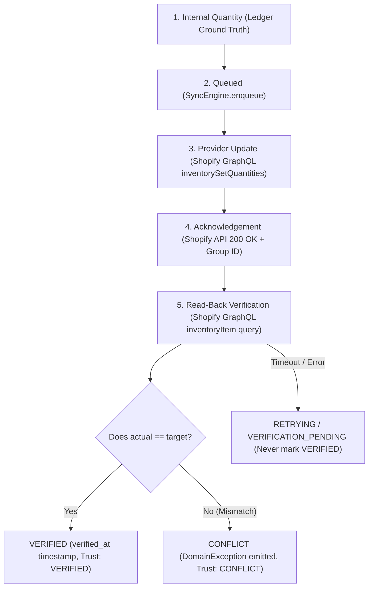

# Shopify Outbound Synchronization and Read-Back Verification

**Status:** `VERIFIED`  
**Governing Documents:**
- `specifications/01_ENGINEERING_SPEC.md` (Sections 24, 25, 36, 121, 122, 140)
- `specifications/02_PRODUCT_DESIGN_SPEC.md` (Section 8 — Freshness & Trust Model)
- `specifications/06_SEQUENTIAL_PROMPTS_V3_SUPABASE.md` (Prompt 15)

---

## 1. Architectural Overview

The **Shopify Verification Subsystem** bridges the generic synchronization framework (`SyncEngine`) with the live `ShopifyAdapter`, governing the end-to-end outbound inventory propagation lifecycle. It enforces the foundational platform rule:

> **Mandatory Invariant:** A synchronization job must **never** be marked `VERIFIED` solely because an outbound HTTP/API write succeeded. Every outbound write requires explicit read-back verification against the external channel before ground truth trust is granted.

---

## 2. The 6 Explicitly Distinguished Verification Stages

Conforming strictly to Prompt 15 and Sections 121, 122, and 140, the system distinguishes six explicit stages during synchronization:

| Stage Identifier | Human Label | Trust State | Description & UI Semantics |
|---|---|---|---|
| `REQUEST_SUBMITTED` | Request Submitted | `UNKNOWN` | Update payload transmitted to Shopify GraphQL endpoint (`sent_at`). |
| `REQUEST_ACKNOWLEDGED` | Request Acknowledged | `UNKNOWN` | Shopify accepted mutation and returned adjustment group ID (`acknowledged_at`). |
| `VERIFICATION_PENDING` | Verification Pending | `UNKNOWN` | Actively querying Shopify GraphQL to observe current live balance. |
| `VERIFIED` | Verified | `VERIFIED` | Read-back quantity strictly equals expected target quantity (`verified_at`). Green success state allowed. |
| `CONFLICT` | Conflict | `CONFLICT` | Read-back quantity differs from target quantity. **Never produces green check.** Operator exception raised. |
| `FAILED` | Failed | `UNKNOWN` | Push mutation rejected (validation, inactive location, unmapped SKU) or retries exhausted. |

---

## 3. Freshness Timestamps & Trust Model

Every external quantity record maintains three canonical freshness timestamps conforming to Section 121:

1. **`observed_at`**: The precise timestamp when the quantity was observed from the channel (via read-back query or webhook).
2. **`received_at`**: The timestamp when the observation was ingested into the platform.
3. **`verified_at`**: The timestamp when read-back verification confirmed the quantity matches internal truth.

### Human-Facing Freshness Formatting

Conforming to `02_PRODUCT_DESIGN_SPEC.md`, freshness is formatted with exact relative human strings:
- *`< 60 seconds`*: `"Last verified 42 seconds ago."` / `"Observed 15 seconds ago."`
- *`Minutes`*: `"Observed 3 minutes ago."` / `"Last verified 3 minutes ago."`
- *`Hours`*: `"Observed 2 hours ago."`
- *`Days`*: `"Observed 1 day ago."`

### Staleness Evaluation

External balances older than the configured TTL (default 5 minutes = `300,000 ms`) automatically transition to trust state `STALE` with `isStale: true`.

---

## 4. Discrepancy & Conflict Handling (Prompt 15 Mandatory Rule)

If Shopify reports a quantity different from the target quantity during read-back verification:

1. **Strictly Forbidden:** Producing a green success state or marking the job `VERIFIED`.
2. **State Transition:** The synchronization job transitions to `CONFLICT`.
3. **Domain Exception:** A structured `DomainException` is automatically emitted:
   - Type: `SYNC_FAILURE`
   - Classification: `CONFLICT`
   - Root Cause Code: `QUANTITY_MISMATCH_CONFLICT`
   - Metadata: `{ expectedQuantity: 25, actualQuantity: 20, observedAt: "..." }`
   - Recommended Action: `"Run inventory reconciliation to inspect discrepancy between ledger and channel."`
4. **UI Notification:** Flagged with warning badge: *"Update submitted. Quantity mismatch detected (expected 25, reported 20)."*

---

## 5. Read-Back Timeout & Transient Failure Semantics

When an outbound write is acknowledged by Shopify, but the subsequent read-back verification experiences an `ETIMEDOUT` or network disruption:

- **Must NEVER be marked `VERIFIED`.**
- The job transitions to `RETRYING` (attempt count incremented).
- The verification stage remains `VERIFICATION_PENDING`.
- If maximum attempts are exhausted, the job escalates to `FAILED` with an alert in the Exception Inbox.

---

## 6. Implementation Artifacts

- **Contracts:** [`packages/contracts/src/sync.ts`](file:///c:/Users/Administrator/Desktop/multi-inventory-channel/packages/contracts/src/sync.ts) (`VerificationStage`, `FreshnessMetadata`, `TrustState`, `getVerificationStageInfo`, `evaluateFreshness`, `formatFreshnessDisplay`).
- **Domain Machine:** [`packages/domain/src/sync-machine.ts`](file:///c:/Users/Administrator/Desktop/multi-inventory-channel/packages/domain/src/sync-machine.ts) (`syncStateToVerificationStage`).
- **Engine Coordination:** [`packages/integrations/src/sync/engine.ts`](file:///c:/Users/Administrator/Desktop/multi-inventory-channel/packages/integrations/src/sync/engine.ts) (Stage callbacks, read-back verification, discrepancy detection).
- **Verification Pipeline:** [`packages/integrations/src/providers/shopify/shopify-verification.ts`](file:///c:/Users/Administrator/Desktop/multi-inventory-channel/packages/integrations/src/providers/shopify/shopify-verification.ts) (`ShopifyVerificationPipeline`).
- **Verification Suite:** [`tests/phase14-shopify-verification.test.ts`](file:///c:/Users/Administrator/Desktop/multi-inventory-channel/tests/phase14-shopify-verification.test.ts) (13 tests passing).
