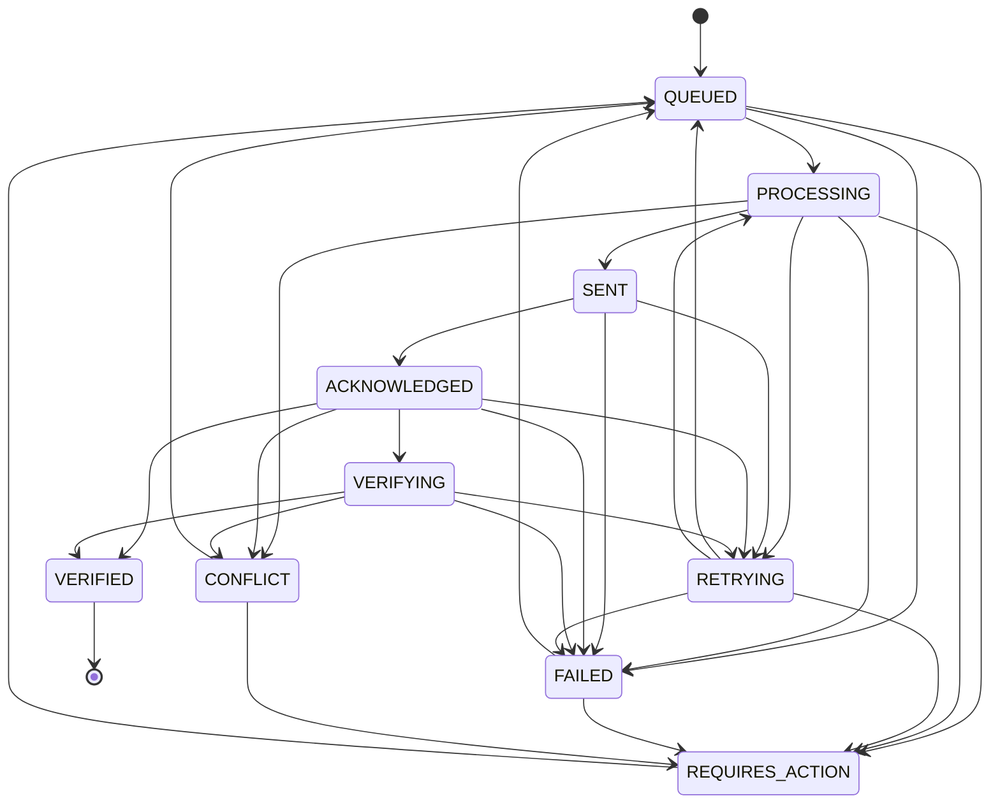

# Domain Models and Integrity Boundaries

**Canonical Specifications:** `00_MASTER_ORCHESTRATION.md`, `01_ENGINEERING_SPEC.md` (Sections 15, 16, 24, 26, 28)  
**Sequential Prompts:** Prompt 07 (Phase 6: Domain Models)  
**Package:** `@platform/domain` (`packages/domain`)  
**Status:** `VERIFIED`

---

## 1. Architectural Purity & Dependency Direction

The `@platform/domain` package is the central authority for business rules, calculations, invariant validation, and domain event generation.

### Invariants:
1. **Zero External Dependencies**: The package has **zero** runtime dependencies in `package.json`. It relies solely on pure TypeScript and the standard library.
2. **Inward Dependency Direction**: Dependencies only flow *inward* toward `@platform/domain`. No domain file imports from database clients (`pg`, `@supabase`), web frameworks (`express`, `next`, `react`), message queues (`bullmq`, `ioredis`), or payment gateways (`stripe`).
3. **Encapsulation of Mutation Truth**: Arbitrary packages or applications must never mutate inventory values directly. All changes must be calculated, validated, and logged as events through `InventoryDomainService`.

```
apps/api --------\
apps/worker ------> [@platform/domain] <------ packages/database
apps/web --------/      (Zero deps)     <------ packages/security
```

---

## 2. Canonical Inventory Formula & Invariants

Available sellable inventory is strictly a derived figure. It is never stored as an independently editable quantity.

### Canonical Formula:
$$\text{available} = \text{onHand} - \text{reserved} - \text{safetyStock} - \text{damaged} - \text{quarantined} - \text{allocated}$$

### Field Definitions:
- **`onHand`**: Total physical inventory located inside the warehouse facility.
- **`reserved`**: Inventory claimed by active pending customer orders, preventing overselling.
- **`safetyStock`**: Merchant buffer held in reserve to safeguard against supplier delays or count variations.
- **`damaged`**: Defective, broken, or unsellable stock quarantined from sale.
- **`quarantined`**: Stock withheld pending QA, recall, or return inspection.
- **`allocated`**: Inventory committed to an order actively in the picking/packing/fulfillment flow.
- **`available`**: Sellable stock eligible for broadcast to external channels.

### Domain Validation:
Any mutation producing negative values on non-negative fields (`onHand`, `reserved`, `allocated`, `safetyStock`, etc.) or calculating an inconsistent `available` figure throws `InventoryInvariantError`.

---

## 3. Inventory Domain Service Operations

`InventoryDomainService` provides deterministic, atomic operations that compute new balance states and yield immutable `InventoryDomainEvent` records:

| Operation | Inputs | State Changes | Emitted Event |
| :--- | :--- | :--- | :--- |
| **`createReservation`** | `balance`, `quantity`, `orderId` | Increments `reserved`, decrements `available` | `ORDER_RESERVATION` |
| **`releaseReservation`** | `balance`, `reservation`, `reason` | Decrements `reserved`, restores `available` | `ORDER_RELEASE` |
| **`fulfillReservation`** | `balance`, `reservation` | Decrements `onHand` and `reserved` atomically | `ORDER_FULFILLMENT` |
| **`allocateReservation`** | `balance`, `reservation` | Moves qty from `reserved` to `allocated` | `ORDER_ALLOCATION` |
| **`fulfillAllocation`** | `balance`, `allocation` | Decrements `onHand` and `allocated` atomically | `ORDER_FULFILLMENT` |
| **`releaseAllocation`** | `balance`, `allocation`, `reason` | Decrements `allocated`, restores `available` | `ORDER_RELEASE` |
| **`applyAdjustment`** | `balance`, `quantityDelta`, `reason`| Adjusts `onHand` (+/-) and recalculates `available` | `MANUAL_ADJUSTMENT` |
| **`applyRecount`** | `balance`, `physicalCount`, `reason`| Sets `onHand = physicalCount`, calculates delta | `RECOUNT` |

---

## 4. Asynchronous Synchronization State Machine

Synchronization operations across marketplaces (Shopify, Amazon, eBay, Walmart) follow a strict asynchronous lifecycle implemented in `sync-machine.ts`.

### State Lifecycle Matrix:



### Mandatory Rules:
1. **Never Mark VERIFIED Prematurely**: Transitions directly from `QUEUED`, `PROCESSING`, or `SENT` to `VERIFIED` are strictly rejected with `InvalidStateTransitionError`.
2. **Verification Gate**: An external write acknowledged with HTTP 200/202 is only `ACKNOWLEDGED`. It remains unverified until downstream read-back verification confirms channel parity.
3. **Retry Escalation**: Each retry increments `attemptCount`. If `attemptCount >= maxAttempts` (default 5), the transition automatically escalates to `FAILED`.

---

## 5. Reconciliation & Discrepancy Classification

The reconciliation engine (`reconciliation-service.ts`) identifies discrepancies between internal warehouse reality and external channel inventory.

### Classification Matrix:
- **`MATCH`**: $\Delta = \text{external} - \text{internal} = 0$. Parity confirmed.
- **`MINOR_DIFFERENCE`**: $|\Delta| \le \text{minorDifferenceThreshold}$ (default 2 units).
- **`MATERIAL_DIFFERENCE`**: $|\Delta| > \text{minorDifferenceThreshold}$. Large variance requiring manual audit.
- **`MISSING_EXTERNAL`**: SKU exists internally but is unlisted or missing on external channel.
- **`MISSING_INTERNAL`**: Listing exists on channel without internal SKU mapping.

### Auto-Reconciliation Invariant:
- `isAutoReconcilable(...)` **strictly returns `false`** for `MATERIAL_DIFFERENCE`, `MISSING_EXTERNAL`, `MISSING_INTERNAL`, or any difference exceeding configured automated limits.
- Material differences and missing entities **must never be auto-resolved** and require human intervention via exception tickets.

---

## 6. Exception Management & Lifecycle

Structured exceptions (`exception-service.ts`) replace generic errors, enforcing traceability and deterministic severity scoring:

### Automatic Severity Scoring:
- **`CRITICAL`**: `NEGATIVE_INVENTORY`, `PROVIDER_OUTAGE`
- **`HIGH`**: `AUTHENTICATION_FAILURE`, `SYNC_FAILURE`, `INVENTORY_MISMATCH`, `DUPLICATE_MAPPING`, `ORDER_IMPORT_FAILURE`
- **`MEDIUM`**: `MISSING_MAPPING`, `ORDER_UNMAPPED_SKU`
- **`LOW` / `INFO`**: `RATE_LIMIT`, `STALE_DATA`

### Lifecycle Flow:
$$\text{OPEN} \longrightarrow \text{INVESTIGATING} \longrightarrow \text{ACTION\_REQUIRED} \longrightarrow \text{RESOLVING} \longrightarrow \text{RESOLVED / IGNORED}$$

Resolving an exception requires actor attribution (`resolvedBy`) and timestamps (`resolvedAt`). Illegal transitions (such as jumping from `RESOLVED` directly to `INVESTIGATING` without reopening) throw `InvalidStateTransitionError`.

---

## 7. Verification Evidence

- **Unit & Domain Tests**: `tests/phase6-domain-models.test.ts` (31 tests passing across 10 suites).
- **Regression Test Suite**: Total repository test suite: **115 tests passing across 41 suites**.
- **Type Checking**: 0 errors across all 9 shared packages and 4 applications (`npm run typecheck`).
- **Build Verification**: Clean compilation (`npm run build`).
